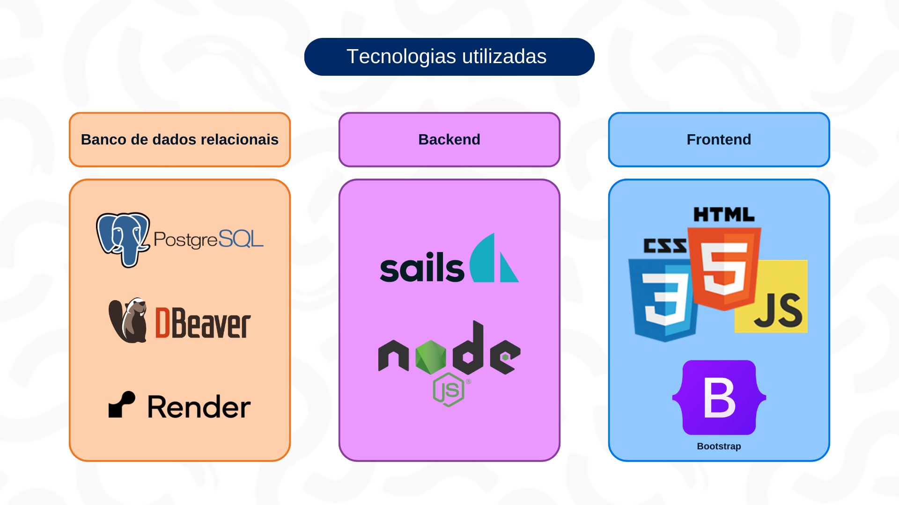

# Arquitetura de sotware

&nbsp;&nbsp;&nbsp;&nbsp;"Arquitetura de software" é a nomeclatura que referencia o plano que orienta o desenvolvimento, a implementação e a evolução de um sistema de software, incluindo os componentes do sistema, suas relações, princípios de design e diretrizes de organização. Definindo como diferentes partes de um sistema interagem entre si,  como os componentes são organizados para atender aos requisitos funcionais e não funcionais do sistema e outras coisas. Desse modo, desempenhando um papel fundamental no desenvolvimento de sistemas eficientes e sustentáveis, servindo como base de uma aplicação e fornecendo a estrutura necessária para organizar e gerenciar os componentes do software de maneira coerente e escalável.

&nbsp;&nbsp;&nbsp;&nbsp; Um dos padrões arquiteturais mais conhecidos e amplamente utilizados é o MVC (Model-View-Controller). O MVC divide uma aplicação em três componentes principais: o Modelo (Model), a Visão (View) e o Controlador (Controller). O MVC oferece uma série de benefícios, incluindo uma clara separação de responsabilidades, o que facilita a manutenção e a extensão do código, além de promover a reutilização de componentes. Este padrão arquiteturial também facilita a colaboração entre equipes, uma vez que diferentes membros podem trabalhar em partes distintas da aplicação sem interferir no trabalho uns dos outros. Segue abaixo o diagrama MVC do projeto:

Figura 26 - Diagrama MVC 

 

Fonte: Material produzido pelos autores (2024)

 

&nbsp;&nbsp;&nbsp;&nbsp;Confira a imagem exposta acima por meio do link: (<https://bit.ly/49TTi5t>).

&nbsp;&nbsp;&nbsp;&nbsp; O nosso projeto será composto por três partes principais, a de login, a de publicações e a de perfil.

&nbsp;&nbsp;&nbsp;&nbsp; Dentro do MVC temos três partes já faladas anteriormente, a primeira é o Modelo (Model), que representa os dados que a aplicação está lidando e como esses dados podem ser manipulados, o segundo é a Visão (View), que é a parte da aplicação que cuida da apresentação dos dados ao usuário, e por ultimo o Controlador (Controller), que gerencia as interações entre o usuário, atuando como intermediário entre o Modelo e a Visão.

&nbsp;&nbsp;&nbsp;&nbsp; Vamos entender como cada parte do nosso projeto se encaixa com essa arquitetura: 
- Dentro do modelo(Models) temos os dados armazenados de acordo com cada parte do projeto.
  - No User armazenamos os dados do usuário, que seriam nome, ID, e-mail, senha, idade, local, gênero pontos e customizações já desbloqueadas do nosso mascote.
  - No Post guardamos os dados de cada postagem, sendo eles o título, conteúdo, anexos e o Id do usuário que a publicou. Essas postagens seriam as oportunidades de voluntáriado.
  - no Preferences armazenamos os dados de preferências de vagas de voluntariado, que seriam os dados sobre o que esse usuário estaria considerando como uma vaga perfeita, sendo eles o Id, a descrição de como seria, os tópicos de maior interesse e a carga horária.

- Dentro dos controladores(Controllers) temos as possíveis interações do usuário.
  - no login do usuário temos:
    - cadastrar: que seria o ato de se cadastrar na plataforma.
    - verificar: que seria a ação de verificar se o candidato já está cadastrado e se seus dados estão certos, assim fazendo login.
  - em publicações temos:
    - criar: que seria a ação de criar uma oportunidade de voluntariado.
    - apresentar: que seria a ação de mostrar a publicação.
    - deletar: que seria o ato de deletar a oportunidade de voluntariado.
  - em perfis temos:
    - apresentar: Apresenta as informações de preferência
    - atualizar: atualiza as informações de preferências do usuário
- Dentro do Views (views) temos o que o usuário consegue ver:
  - login: Apresenta uma tela de login ou de cadastro, dependendo se já é cadastrado ou não.
  - publicações: temos a visualização das oportunidades de voluntariados disponíveis.
  - perfil: temos o acesso as informações do usuário e a possibilidade de alterá-las.  

&nbsp;&nbsp;&nbsp;&nbsp;Na figura abaixo, podemos ver também quais tecnologias estão presentes no projetos:

Figura 27 - Tecnologias utilizadas 

 

Fonte: Material produzido pelos autores (2024)

 

&nbsp;&nbsp;&nbsp;&nbsp;Confira a imagem exposta acima por meio do link: (<https://bit.ly/4dibOra>).

Portanto, essa arquitetura atende aos nossos requisitos por dar a base para a construção de todas as partes essencias do projéto. E a sua construção foi feita seguindo a identidade visual do projeto, por exemplo estando presente o nosso mascote, o Oppo.